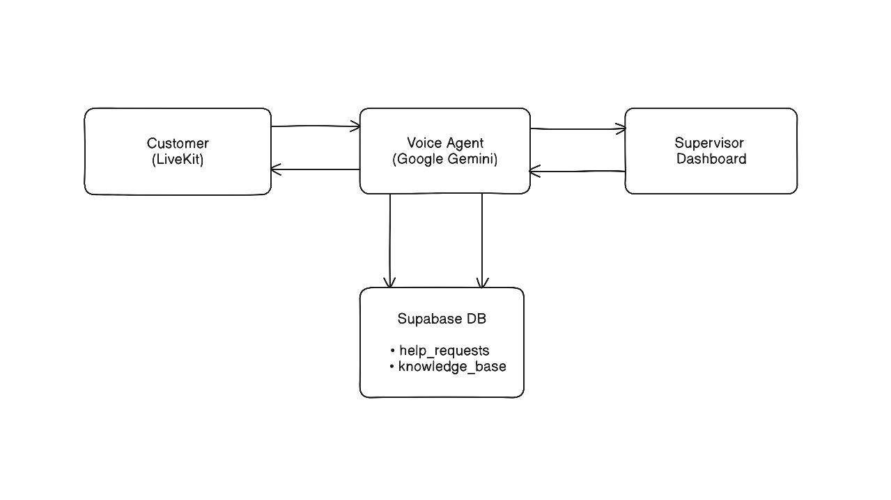

# AI Voice Agent with Supervisor Escalation

A full-stack voice AI assistant for Glamour Hair Salon with real-time supervisor escalation, knowledge base learning, and appointment scheduling.

##  Overview

This project demonstrates an intelligent voice agent that can:
- Answer customer questions about the salon
- Escalate to human supervisors when uncertain
- Learn from supervisor answers via knowledge base
- Schedule appointments using Cal.com or fake calendar
- Handle real-time voice conversations using LiveKit + Google Gemini

## 🏗️ Architecture



## 📁 Project Structure

```
ai-agent-v3/
├── agent/                      # LiveKit voice agent (Node.js)
│   ├── agent.ts               # Main agent logic
│   ├── lib/
│   │   ├── supabase.ts        # Supabase client
│   │   ├── db-help-requests.ts # Help request database operations
│   │   ├── db-knowledge-base.ts # Knowledge base operations
│   │   └── calendar_api.ts    # Calendar integration
│   └── .env.local             # Agent environment variables
│
├── frontend/                   # Next.js supervisor dashboard
│   ├── app/
│   │   ├── page.tsx           # Home page
│   │   ├── supervisor/
│   │   │   └── page.tsx       # Supervisor dashboard
│   │   └── api/
│   │       ├── knowledge/     # Knowledge base API
│   │       └── supervisor/    # Supervisor API endpoints
│   ├── lib/
│   │   ├── supabase.ts        # Supabase client
│   │   ├── db-help-requests.ts
│   │   └── db-knowledge-base.ts
│   └── .env.local             # Frontend environment variables
│
└── supabase-schema.sql        # Database schema
```

## 🚀 Setup

### Prerequisites

- Node.js 18+ and npm
- LiveKit account
- Google Gemini API key
- Supabase account
- Cal.com account (optional, for real appointments)

### 1. Clone and Install

```bash
# Clone the repository
cd ai-agent-v3

# Install agent dependencies
cd agent
npm install

# Install frontend dependencies
cd ../frontend
npm install
```

### 2. Supabase Setup

1. Create a new Supabase project at https://supabase.com
2. Run the SQL schema from `supabase-schema.sql` in the SQL Editor
3. Get your credentials from Project Settings → API

### 3. Environment Variables

Create `.env.local` files in both `agent/` and `frontend/` directories:

**agent/.env.local:**
```env
# LiveKit Configuration
LIVEKIT_URL=wss://your-project.livekit.cloud
LIVEKIT_API_KEY=your-api-key
LIVEKIT_API_SECRET=your-api-secret

# Google Gemini API
GOOGLE_API_KEY=your-gemini-api-key

# Supabase Configuration
SUPABASE_URL=https://your-project.supabase.co
SUPABASE_SERVICE_ROLE_KEY=your-service-role-key

# Optional: Cal.com Integration
CAL_API_KEY=your-cal-api-key

# Optional: Timezone
TIMEZONE=America/New_York
```

**frontend/.env.local:**
```env
# LiveKit Configuration
LIVEKIT_API_KEY=your-api-key
LIVEKIT_API_SECRET=your-api-secret
LIVEKIT_URL=wss://your-project.livekit.cloud

# Supabase Configuration
NEXT_PUBLIC_SUPABASE_URL=https://your-project.supabase.co
NEXT_PUBLIC_SUPABASE_ANON_KEY=your-anon-key
SUPABASE_SERVICE_ROLE_KEY=your-service-role-key
```

### 4. Run the Application

**Terminal 1 - Start the Agent:**
```bash
cd agent
npm run dev
```

**Terminal 2 - Start the Frontend:**
```bash
cd frontend
npm run dev
```

**Then go to: 'https://agents-playground.livekit.io/' and start the playground**


### Customer Flow

1. Click "Connect" to join the voice room
2. Grant microphone permissions
3. Start talking to the AI assistant
4. Ask questions like:
   - "What are your hours?"
   - "How much is a haircut?"
   - "Can I schedule an appointment?"

### Supervisor Flow

1. Visit http://localhost:3000/supervisor
2. View pending help requests in the dashboard
3. Click "Provide Answer" on any request
4. Type a natural answer and submit
5. The answer is automatically:
   - Saved to the database
   - Added to the knowledge base
   - Available for future similar questions

### Knowledge Base Learning

The agent learns from supervisor answers:

1. **First time**: Customer asks "What are your refund policy?"
   - Agent doesn't know → Escalates to supervisor
   - Supervisor answers: "We do not provide refunds."

2. **Next time**: Another customer asks the same/similar question
   - Agent finds answer in knowledge base
   - Responds naturally: "Currently we do not provide any refund."

## 🔧 Design Notes

### Key Features

#### 1. **Intelligent Knowledge Base**
- **Fuzzy matching**: Matches similar questions, not just exact phrases
- **Usage tracking**: Tracks how often KB entries are used
- **Natural responses**: AI rephrases KB answers conversationally
- **Auto-refresh**: Picks up new KB entries every 30 seconds

#### 2. **Supervisor Escalation**
- **Tool-based**: Uses LLM function calling to request help
- **Context preservation**: Captures room and participant info
- **Real-time updates**: Dashboard refreshes every 5 seconds
- **Timeout handling**: Auto-closes stale requests after 1 hour (request status changes to 'unresolved')

#### 3. **Appointment Scheduling**
- **Calendar integration**: Cal.com or fake calendar fallback
- **Natural language**: "Book me for Tuesday at 11:30 AM"
- **Slot management**: Shows available times conversationally
- **Email capture**: Optional email for confirmations

#### 4. **Cache-Free Architecture**
- **No stale data**: All API routes use `force-dynamic`
- **Cache-busting**: Frontend adds timestamps to requests
- **Instant updates**: Changes reflect immediately

### Technical Decisions


### Database Schema

**help_requests table:**
```sql
- id: UUID (primary key)
- room_name: TEXT
- participant_identity: TEXT
- question: TEXT
- status: ENUM (pending, resolved, unresolved)
- supervisor_answer: TEXT
- created_at: TIMESTAMP
- resolved_at: TIMESTAMP
- timeout_at: TIMESTAMP
```

**knowledge_base table:**
```sql
- id: UUID (primary key)
- question: TEXT
- answer: TEXT
- source_request_id: UUID (foreign key)
- created_at: TIMESTAMP
- updated_at: TIMESTAMP
- usage_count: INTEGER (default 0)
```

### Agent Flow

1. **Initialization**
   - Load environment variables
   - Connect to Supabase
   - Load knowledge base entries
   - Initialize calendar

2. **Connection**
   - Join LiveKit room
   - Wait for participant (`ctx.waitForParticipant()`)
   - Capture room name and participant identity
   - Start voice session

3. **Conversation**
   - User speaks → Gemini transcribes
   - Check knowledge base for matching answer
   - If found: Respond naturally using KB data
   - If not found: Try to answer or escalate

4. **Escalation**
   - Call `request_help` tool
   - Create help request in database
   - Notify supervisor via console
   - Tell user: "Let me check with my supervisor"

5. **Knowledge Update**
   - Supervisor provides answer
   - Auto-added to knowledge base
   - Available for next question
   - Agent uses it 

### Frontend Components

- **Supervisor Dashboard**: Real-time pending requests view
- **History Tab**: All past requests (resolved/unresolved)
- **Knowledge Base Tab**: All learned Q&A pairs
- **Auto-refresh**: Polls every 5 seconds
- **Cache prevention**: No stale data issues


